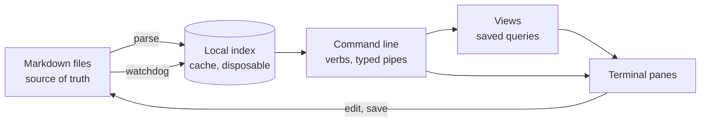

# Structura

This document is a product design for a structured knowledge work environment. It describes an editing surface for
markdown-based records, a data model built around notes, links, and item records, and a command-driven interface that
makes the underlying rules explicit rather than incidental.

The goal is to replace a patchwork of editor conveniences with a single focused tool that keeps the source files as the
truth, while making the rules of the content model hard to violate.

---

## 1. Problem and goals

The existing workflow works well enough for a small and careful team, but it depends on a general-purpose editor plus a
set of separate scripts and generated views. The result is a system that is correct only when the right steps are
remembered in order.

Structura is the product that turns those rules into a first-class experience: a structured note editor and query tool
that treats the working files as the document store and provides the missing capabilities of a purpose-built workspace.

| Missing today                 | Structura supplies                                                         |
| ----------------------------- | -------------------------------------------------------------------------- |
| A query engine                | A local index rebuilt from the files, with typed query commands            |
| Live views                    | Saved queries evaluated when opened, never stale                           |
| Structure-aware editing       | Autocomplete for links and enums, with forms for metadata and item records |
| One surface for the whole job | Navigate, query, edit, preview, and manage the register from one window    |

The thesis, in one sentence: the validator is a list of rules the editor should have enforced — every rule it checks is
a mistake that was possible to make. Structura moves each rule from detected to impossible, while keeping validation as
a backstop for anything edited outside the tool.

Concretely, several validation rules stop being reachable from inside Structura:

- A wikilink cannot land in frontmatter, because frontmatter is edited as typed fields, not as free text.
- A closed enum cannot accept an invalid value, because the choice comes from the schema.
- An item line cannot miss the grammar, because items are composed structurally and then serialized.
- An item cannot be wrapped by a formatter into losing a required field, because the app does not rewrite lines it did
  not ask you to edit.

## 2. What "shell emulator" means here

This phrase needs a precise definition before development begins, because it has two common readings and only one is
wanted.

**Not this:** a terminal emulator that runs a full operating-system shell inside the app. That introduces a large,
platform-specific, security-relevant subsystem and would reintroduce dependencies the product is trying to avoid.

**This:** a domain command line — a prompt inside Structura whose vocabulary is the knowledge base, not the filesystem.
The nouns are notes, items, links, and assets; the verbs are search, items, backlinks, new, rename, export, and similar
actions. Its pipe carries typed result sets, not raw shell output. It is closer to a notes formula bar, a minibuffer, or
a command line with completion than to a full operating-system shell, but with the useful parts of shell interaction:
pipes, history, and completion.

Every verb is a function in a registry. Nothing spawns a subprocess except a controlled VCS call, and even then with
explicit arguments rather than a shell command string. Consequences worth having: it behaves identically across
workstations, it is unit testable without a terminal, and its full surface area is enumerable.

## 3. Constraints — the deciding forces

Ordered by how much they decide.

1. Structura is meant to replace a general editor for knowledge work, not to sit beside it forever. This is the
   constraint that decides the most, because it converts every editorial capability the system relies on today into a
   product requirement with a delivery date.
2. The shipped artifact is a compiled desktop executable for a known platform. Dependencies are resolved and compiled at
   build time, so the application keeps working regardless of the local runtime environment.
3. Files are the truth. Local-first flat markdown is the authoring model. The database is a cache with no authority.
4. It runs on the workstation, for one user, offline. No server, no sync service, no port bound.
5. The design must stay compatible with the existing record model during the migration period, while making the
   long-term state simpler than the legacy setup.

## 4. What carries over from the existing record model

The current design is the requirements document. Four things transfer intact.

**The four layers** become the four layers of the application:

| Layer       | In the current record model                | In Structura                                      |
| ----------- | ------------------------------------------ | ------------------------------------------------- |
| 1. Entities | Asset, person, org, document, project      | Rows in notes; the navigator's asset tree         |
| 2. Events   | Observation, meeting, daily                | Rows in notes, ordered by date                    |
| 3. Items    | `#item` lines in the note that raised them | Rows in `items`, edited through the item composer |
| 4. Views    | Generated files in a register folder       | Saved queries evaluated live, optionally exported |

**The two rules** are enforced by construction rather than convention: links live in bodies because frontmatter is a
typed form with no free-text link field; a tag is a quality because tags are a distinct completion context from `[[`.

**The parser moves across whole.** The previous parsing and validation logic becomes the core of the vault layer:
markdown parsing, schema validation, item parsing, and re-export. That is not code reuse for its own sake: every rule in
the parser represents a bug that was found the hard way against real content, and rewriting it would be volunteering to
find them again. The same goes for the renderers that generate derived files.

**The house style of the record** — sized problems, mechanism before evidence, tables for parallel facts — is what the
app should make easy to write and never rewrite on its own.

## 5. Architecture



Five modules, each with one job and a testable boundary:

| Module            | Job                                                                                    | Depends on               |
| ----------------- | -------------------------------------------------------------------------------------- | ------------------------ |
| `structura.vault` | Parse and validate markdown; load the schema; serialize items and frontmatter back out | YAML parser, TOML parser |
| `structura.index` | Local database schema, incremental rebuild, queries, file watcher                      | vault                    |
| `structura.shell` | Tokeniser, pipeline type-checker, verb registry, history                               | index, vault             |
| `structura.views` | Named saved pipelines; the export renderers that reproduce generated views             | shell                    |
| `structura.ui`    | Terminal app: panes, editor, completer, keymap                                         | all of the above         |

The dependency arrows run one way. The UI layer is the only module that imports a terminal UI framework, so everything
below it can be tested headlessly.

## 6. The schema and the index

### Where the schema lives

**Decision: the schema is data, in a root configuration file, not constants in code.** Today the validation rules are
module-level dicts. That is right for one project with one schema; it is wrong the moment a second project exists,
because a personal vault wanting a different set of enums would need a code change to a tool shared with a work vault.

```toml
[schema]
required = ["type", "title", "date"]
types    = ["asset", "person", "org", "document", "project", "meeting", "observation", "note", "resource", "index"]

[schema.enums]
area = ["paint", "wwt", "monorail", "power-free", "plant"]

[schema.status]
asset       = ["operating", "degraded", "down", "removed"]
observation = ["open", "contained", "resolved"]

[schema.required_for]
asset = ["area"]

[index]
skip      = ["0-Index", "6-Archive", "docs", "node_modules"]
link_skip = ["6-Archive", "docs", "node_modules"]
```

Three properties this has to keep, because each one is load-bearing:

- **The file is tracked and reviewable.** A schema change becomes a diff someone can read.
- **A missing schema file is not an error.** An unconfigured workspace gets built-in defaults.
- **The shipped schema is byte-equivalent to the legacy constants**, and a test asserts it: the enums parsed from the
  default schema equal the application constants, field for field.

Structura validates the schema file itself on load — an unknown key, a non-list enum, or a `required_for` naming a type
that is not in `types` should fail loudly at startup rather than produce a workspace where nothing is checked.

Everything downstream reads the schema from one place: the validator, the frontmatter form's pick-lists, the completion
contexts, and the column promotion in the index below.

### The index

**The rule that governs it: the index is a cache and never a source. Deleting the index must lose nothing but a few
hundred milliseconds.** This is the same rule that keeps the content honest: everything a user types goes to a file
first; the index is updated from the file, never the other way round.

Stored at `<workspace>/.structura/index.db`, gitignored. Inside the workspace so it is per-project and travels with a
copy, not in a user cache directory where two projects could collide.

### Index tables

```sql
files      (path PK, mtime, size, sha256, indexed_at)
notes      (path PK → files, title, type, date, area, status, parent, mtime)
properties (path, key, value)                    -- every frontmatter scalar, incl. free-form keys
tags       (path, tag)
aliases    (alias PK, path)
links      (src_path, target_raw, target_norm, section, is_embed, line_no)
items      (path, line_no, description, asset, owner, raised, due, ref, done)
notes_fts  (title, body)                         -- FTS5, external content over notes
```

Two notes on shape. `properties` is a key/value table rather than columns, so a free-form frontmatter key needs no
migration; only the enum-checked keys named in the schema get promoted to columns on `notes` for indexing. And
`target_norm` holds the alias-resolved title, so multiple titles or aliases resolve to the same target without every
query knowing about the alias map.

### Incremental reindex

On startup and on every watcher event: stat the file, compare `(mtime, size)`, hash only on mismatch, and reparse only
on hash change. A changed note deletes its rows by `path` and reinserts — no diffing, because reparsing one note is
already cheap and diff logic would be a source of drift for no measurable gain.

A watcher handles external edits so the UI updates without a keystroke. Structura's own saves record the expected hash
before writing so the resulting event is recognised and skipped, rather than bouncing back through the parser.

Access model: WAL mode, one writer connection owned by the indexer thread, a read-only connection per reader. The event
loop never blocks on the database.

### Performance budget

Numbers, so they can be measured rather than argued about.

| Operation                            | Budget   |
| ------------------------------------ | -------- |
| Cold full reindex                    | < 300 ms |
| Incremental reindex of one note      | < 20 ms  |
| Keystroke to completion list on `[[` | < 50 ms  |
| Launch to usable window              | < 500 ms |

Full reindex must stay cheap enough that "delete the database" is always an acceptable answer to any index bug.

## 7. The command line

The centrepiece. One line at the bottom of the window, always present, focused with a keyboard shortcut.

### Grammar

```
verb [positional] [key:value ...] [--flag] [| verb ...]
```

Deliberately the same `key:value` shape as an item line. The project already has one metadata grammar; the application
should not teach a second. Values are a bare token, a `"quoted string"`, or a `[[wikilink]]`.

Comparison suffixes on ordered fields: `age>90`, `raised<2026-01-01`, `due<today`.

### Typed pipes

This is the part that is not a shell. A stage does not emit text; it emits a set of notes or items, and each verb
declares what it consumes and produces.

```
find type:asset area:wwt | backlinks | where type:observation | sort date desc | table
items open age>120 | table age,item,asset,owner
grep "riser pressure" | open
placeholders | head 10 | table
```

Because the types are declared, the pipeline is checked before it runs. A bad pipeline fails at parse time rather than
halfway through the action.

### Verbs, v1

| Verb                                | Signature     | Notes                                                |
| ----------------------------------- | ------------- | ---------------------------------------------------- |
| `find`                              | – → notes     | by type, area, status, tag, title, date              |
| `grep`                              | – → notes     | full-text search                                     |
| `items`                             | – → items     | open, done, owner, asset, age, due                   |
| `links` / `backlinks`               | notes → links | outbound / inbound                                   |
| `placeholders`                      | – → links     | unwritten targets ranked by inbound count            |
| `orphans`                           | – → notes     | no inbound links                                     |
| `where` / `sort` / `head` / `count` | any → same    | pipeline plumbing                                    |
| `table` / `list` / `tree`           | any → view    | how results render                                   |
| `open`                              | notes → –     | load into the document pane                          |
| `new`                               | – → notes     | from a template                                      |
| `rename`                            | note → –      | rename the file and rewrite every wikilink to it     |
| `move`                              | notes → –     | move between folders; links unaffected               |
| `set` / `tag` / `untag`             | notes → notes | frontmatter edits, schema-checked before writing     |
| `lint`                              | – → text      | validation output                                    |
| `reindex`                           | – → text      | full or incremental rebuild                          |
| `export`                            | any → –       | write a result to a markdown file                    |
| `view`                              | –             | save / list / load a named pipeline                  |
| `delete`                            | notes → –     | delete a note; reports what linked to it first       |
| `wrap`                              | notes → –     | explicit reflow to a chosen width                    |
| `workspace`                         | –             | open / recent / switch                               |
| `git`                               | –             | status, diff, commit, sync — explicit and controlled |
| `help`                              | – → text      | per-verb guidance                                    |

No `!` escape to a system shell in v1. If a command-line escape is ever wanted, it should be a fixed allowlist of
operations, not a free-form command string.

History persists to a local history file. Up walks it, Tab completes verbs, keys, and values from the index, and the UI
shows the top match as ghost text.

## 8. Views

**A view is a saved pipeline.** This is the part worth keeping from previous notes systems: a view was a selection
formula plus a column list, not a stored copy of anything, so it was never out of date. Generated registers are stored
copies that drift as soon as content changes.

```
view save "Open by age"  items open | sort age desc | table age,item,asset,owner,raised,source
view save "WWT open"     items open area:wwt | sort age desc | table
view save "Write next"   placeholders | head 20 | table
```

Saved views live in a plain-text configuration file, hand-editable and reviewable in a diff. They appear in the
navigator; selecting one evaluates it and fills the view pane.

Generated markdown remains available as an export format rather than the only way to see a register. This is the correct
relationship: generated files are a representation, not the system of record.

## 9. The editor

**Source mode is the default and the only mode you type in.** Preview is a toggle, never an editing surface. This is the
correct call for content where the schema is expressed in the text itself — an item's owner, a `Part of` line, the
ignore guards — and a WYSIWYG layer over text that is itself the data model is a machine for producing files that look
right and index wrong.

### Wikilink autocompletion

Typing `[[` opens an overlay list at the cursor, backed by one indexed query. Ranking, in order:

1. Exact prefix match on title or alias
2. Inbound link count
3. Recently opened
4. Placeholders included and marked

`Enter` inserts the canonical title; `Ctrl+Enter` inserts an alias if one is selected. Completion is not limited to
`[[`:

| Trigger                    | Completes from                     |
| -------------------------- | ---------------------------------- |
| `[[`                       | titles, aliases, placeholders      |
| `#`                        | tags in use, ranked by count       |
| `![[`                      | titles, then `#sections` after `#` |
| an enum key in frontmatter | the closed enum set                |
| the command line           | verbs, keys, values                |

All five are the same widget over the same index.

### Frontmatter as a form

The property pane above the editor renders frontmatter as typed fields from the schema: closed enums as pick-lists,
dates as dates, tags as a chip list, everything else as text. `type` selects which keys are required and which enums
apply. Two of the validator's rule classes cannot be violated through it, and a note edited elsewhere still gets caught
by lint.

### Items as structures

A dedicated item composer opens with a keyboard shortcut: description, asset, owner, raised date, due date, and
reference. It emits the exact one-line grammar from the same module that parses it, so the near-miss classes are not
created inside the app. Existing item lines remain editable as text when needed; the composer is the fast path, not the
only one.

### Not reformatting, and what happens to a formatter

Structura writes back only the bytes it changed. It does not reflow prose, realign tables, or normalise frontmatter key
order. This is the basis of the acceptance tests: a source file must remain stable under an ordinary save.

What changes is where formatting runs. Formatting becomes a CI check and an explicit wrap verb available inside the app.
Never on save, in either place.

The `wrap` verb does the two things that matter: reflow prose to the chosen width and align table pipes. It does not
attempt a full markdown normaliser, and CI is the backstop for drift.

## 10. Preview, embeds, and the flatten step

Preview renders with a markdown widget and a pre-pass that resolves embed links against the index. This grants a single
resolver for both preview and export.

The embed resolver becomes the flatten step for document export: a command writes the same expansion the preview shows
as plain markdown, ready for downstream tooling. One resolver, two consumers, and a deferred cycle closes as a side
effect rather than as a project.

## 11. Coexistence, and retiring the general editor

The end state is that the general editor is not used for structured knowledge work. That is a goal with a delivery list
attached, and the list is the honest part: every editor capability the process currently relies on is a Structura
requirement, and until it ships, the migration is a transition rather than a plan.

| Editor capability               | Structura replacement                                 | Phase |
| ------------------------------- | ----------------------------------------------------- | ----: |
| Edit markdown, syntax highlight | Source-mode editor                                    |     4 |
| Wikilink completion, navigation | Index-backed completer and navigation history         |     4 |
| Backlinks panel                 | `backlinks` verb and a side pane                      |     3 |
| Placeholders panel              | `placeholders` verb and saved view                    |     2 |
| Markdown preview                | Preview toggle with embed resolution                  |     5 |
| Templates, daily note           | `new` verb, daily template, and quick note creation   |     6 |
| Search across the workspace     | FTS5 via `grep`                                       |     1 |
| File tree, rename, move, delete | Navigator plus direct file operations                 |   3–4 |
| Reindex build task              | `reindex` plus the watcher                            |     1 |
| Format on save                  | CI check plus explicit `wrap` verb                    |     7 |
| Source control UI               | `git` verbs plus a diff pane                          |     7 |
| Graph view                      | A link-neighbourhood tree, not a force-directed graph |     7 |

The graph is the one honest gap. A force-directed graph is not a thing a terminal draws well, and pretending otherwise
would produce something worse than the current state. What a terminal does draw well is a tree, and what the graph is
actually used for — what a note reaches and what reaches it — is a tree query the index answers directly.

**Until the migration is complete, the compatibility contract still holds** because a half-migrated workspace must stay
editable in both the old and new surface:

| Concern        | Contract                                                                                   |
| -------------- | ------------------------------------------------------------------------------------------ |
| Files          | No tracked file changes shape; Structura adds a local metadata folder and config file      |
| Editors        | Fully functional throughout the transition; both may be open on the same workspace at once |
| Formatting     | Keeps formatting from CI rather than on save until the explicit wrap command is in place   |
| Legacy tooling | Keeps working while Structura learns the same rules                                        |
| Git            | Structura never commits implicitly; explicit git verbs only                                |

Concurrent editing takes the same ruling as a single-writer workflow with a conflict prompt rather than silent
clobbering. If a note changes on disk while an editor buffer is dirty, save prompts reload / overwrite / save a copy
with the on-disk modification time shown.

## 12. Screens and keys

The three-pane layout is a strong default because it makes the content model visible without requiring a large amount of
reading.

```
┌─ Navigator ──────┬─ View ─────────────────────────────────────┐
│ Folders          │ Item                   Asset      Owner  │
│ Saved views      │ Diagnose...            ...        ...    │
│ Assets (tree)    │ Install delivered...    ...        ...    │
│ Tags             ├─ Document ─────────────────────────────────┤
│ Placeholders     │ ---                                        │
│                  │ type: observation                          │
│                  │ status: contained                          │
│                  │ ---                                        │
├──────────────────┴────────────────────────────────────────────┤
│ > items open age>120 | table                                  │
│ workspace ready · index fresh                                │
└───────────────────────────────────────────────────────────────┘
```

The asset tree in the navigator is built from body relationships such as parent or containment lines.

| Key      | Action                 | Key           | Action                    |
| -------- | ---------------------- | ------------- | ------------------------- |
| `Ctrl+L` | focus the command line | `Ctrl+E`      | toggle source / preview   |
| `Ctrl+P` | command palette        | `Ctrl+S`      | save                      |
| `Ctrl+O` | quick open by title    | `Ctrl+K`      | insert wikilink           |
| `Ctrl+I` | new item               | `Ctrl+B`      | backlinks of current note |
| `F5`     | reindex                | `Alt+←` / `→` | navigation history        |
| `F2`     | rename note            | `Ctrl+J`      | today's journal note      |

Bindings live in a local configuration file so they are yours to change; the table above is the default.

**Startup opens today's journal note.** Not the last workspace, not an empty pane — for a daily-driver knowledge system,
the landing is the day. One wrinkle is worth deciding now: the note usually does not exist yet, and creating it on every
launch would seed the workspace with empty dailies for every day the app was merely opened. The design resolves this by
opening an unsaved buffer rendered from the daily-note template, writing the file on the first save.

**One workspace is open at a time**, with switching rather than restarting: open a different workspace closes the
current index and opens another, and the navigator lists recent workspaces. Each workspace owns its own local index and
configuration, so personal and work projects can disagree about their schemas entirely — which is the point of modular
schema management.

## 13. Testing and the acceptance test

The definition of done for v1 is a parity gate, in the spirit of a reconstruction diff: an aggregate match is not
sufficient, the output must be identical.

1. **Export parity.** For each of the generated views, Structura's export is byte-identical to the legacy output for the
   same workspace.
2. **Lint parity.** `structura lint` returns exactly the violation list of the validator on both a clean workspace and a
   fixture workspace seeded with every violation class.
3. **Round-trip fidelity.** Open each note in source mode and save each without editing → the working tree stays empty.
   This is the test that keeps the no-reformatting promise honest.
4. **Index equivalence, property-based.** For a generated workspace, every query answer from the local database equals
   the answer computed directly from the parsed notes.
5. **Shell verbs.** Unit tests per verb, plus pipeline type-check tests asserting the bad pipelines fail at parse time.
6. **UI.** Headless interaction tests for open a note, type `[[`, and assert the completion list; snapshot tests for
   panes.
7. **Schema fidelity.** The enums parsed from the shipped default schema equal the legacy constant values, field for
   field.
8. **Frozen-build smoke test.** The packaged executable starts, opens a fixture workspace, and exits non-zero if any
   startup checks fail.

Tests 1 and 3 run against real content, not a fixture. A product whose whole job is the upkeep of structured notes
should be gated on real content.

## 14. Packaging and dependencies

Two artifacts, one source tree. **Development** is an environment-managed project with a pinned lockfile and a build
command that runs the app from source. **Distribution** is a single desktop executable built by CI.

The executable is the more consequential half, because it changes what the program depends on at rest. Once every
dependency is compiled into the binary, the app no longer depends on the local runtime environment or an approval that
could lapse.

### The build

CI, on every push and tag:

1. Install dependencies from the lockfile.
2. Run the full test suite, including the parity gates.
3. Run a formatting check.
4. Build a one-file executable.
5. Upload the executable as a build artifact and attach it to the release on a tag.

Three things about a frozen app are cheaper to design for than to debug:

- **Package data must be bundled.** The application includes its default schema and templates as packaged resources.
- **The local database engine is frozen in too.** Whether full-text search and JSON support is available becomes a
  property of the build, not of the workstation.
- **Build it as a console application.** A terminal app double-clicked from Explorer with no console attached has
  nowhere to draw. Ship it as a console binary and launch it from a terminal host; a shortcut that opens the terminal on
  the executable is the friendly version of that.

### Dependencies

Checked rather than assumed.

| Set                   | Purpose                                             |
| --------------------- | --------------------------------------------------- |
| Core                  | terminal UI framework, YAML handling, file watching |
| Optional syntax layer | source highlighting and completion helpers          |
| Database layer        | local embedded database with full-text indexing     |

The decision is that syntax support remains optional for the default application, but the product still keeps a
deliberate, minimal dependency footprint.

## 15. Order of work

Bottom-up, so each phase is testable before anything sits on it, and each ends at something usable.

| Phase | Delivers                                                                                     | Gate                                         |
| ----- | -------------------------------------------------------------------------------------------- | -------------------------------------------- |
| 0     | Project skeleton, schema file, validation and index tests                                    | Ported tests green; schema matches defaults  |
| 1     | Local index, incremental rebuild, watcher — no UI                                            | Acceptance tests 1, 2 and 4                  |
| 2     | Command line as a headless REPL over the index                                               | Verb and pipeline-type tests                 |
| 3     | Terminal shell: three panes, navigator, view pane, command line                              | Read-only workspace browsing that feels fast |
| 4     | Editor: source mode, save, link completion, conflict prompt                                  | Acceptance test 3                            |
| 5     | Preview, embed resolution, export flattening                                                 | The note model renders end to end            |
| 6     | Frontmatter form, item composer, templates, journal-on-startup, workspace switch             | Lint stays clean editing only in Structura   |
| 7     | Retire the general editor: git pane, wrap verb, link-neighbourhood tree, packaged executable | Real work with the editor closed             |

**Phase 1 is the review checkpoint** because if the index and the parser disagree with the legacy output, everything
above them is built on sand. Phases 0–2 produce no window at all, and that is deliberate — by the end of phase 2 the
workspace is queryable from a REPL, which is already more than exists today.

**Phase 7 has a behavioural gate, not a test.** The list in §11 can be complete and the tool still not be worth
switching to; the only honest check is a week of real knowledge work with the general editor closed, and a list of what
you reached for and could not find. CI and the executable land here too — early enough to be useful, late enough that
there is something worth installing.

## 16. Non-goals

Explicitly excluded, to keep v1 finishable:

- **A terminal emulator / PTY.** Not what was asked for, and the costly misreading of it.
- **Sync, server, or multi-user.** The local workspace is the source of truth. Single-writer workflow is the model.
- **Coworker distribution.** It is not v1. Handing a colleague a tool means handing them a workspace, a schema, and a
  support burden.
- **Publishing.** Permanently out of scope for a private knowledge workspace.
- **A plugin API.** A verb registry is already the extension point; a public API before there is a second user is
  guesswork.
- **Replacing the editor for code.** Retiring it for PKM work is the goal; Structura is a note editor and has no
  ambition to open arbitrary source files.
- **Reformatting on save.** Formatting is explicit — the wrap verb and CI gate.
- **A force-directed graph view.** A link-neighbourhood tree instead.
- **Encryption at rest.** The privacy control is that the workspace is private; adding a second one nobody asked for
  invites the question of key management.

---

## Open questions

- **Framework undecided.** The product needs a terminal UI with strong keyboard workflow and cheap local indexing. The
  exact frontend framework is not yet locked, and the decision should stay open until an interaction prototype is built
  and measured.
- **Whether generated register files stay in the workspace.** The app can compute them live, but the repository may
  still want files for browser access and simple git review.
- **Which schema variations are supported for personal and work projects.** The design should allow per-workspace
  configuration without forcing a forked product.
- **How strict the item grammar should be for non-asset work.** The current design assumes asset-bound records, but
  personal workflows will likely need an exception.

This design is intentionally written to keep the product direction clear while leaving a small number of architecture
and workflow questions open until the prototype answers them.
