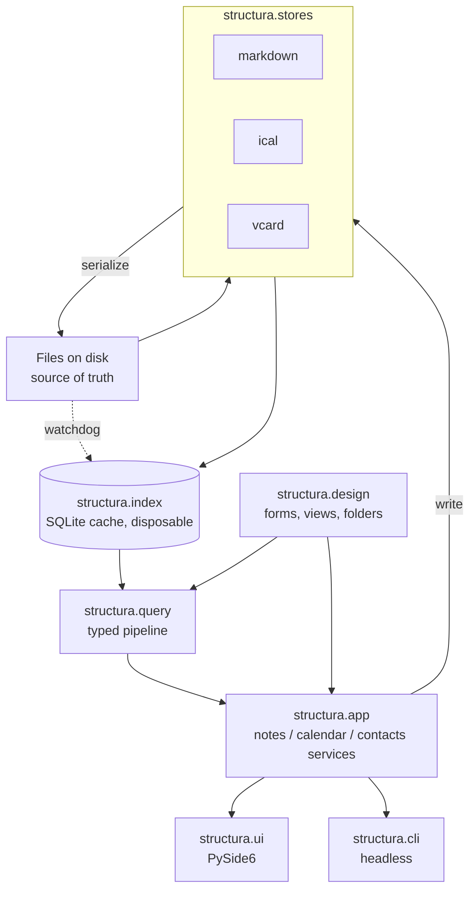

# Structura

Structura is a single-user document database with a personal information manager built on it. It is an open-source
answer to the question "what was Lotus Notes actually good at, and can you have that without the server, the lock-in,
and the mail?"

The answer this design gives: yes, if you keep four ideas and throw away everything else. Documents are bags of fields.
A form says how you edit one. A view is a selection plus columns, evaluated live and therefore never stale. An agent is
code that runs over a set of documents. Everything Structura ships — notes, calendar, contacts, tasks — is built out of
those four ideas rather than beside them.

What it is not is a mail client. Outlook and Thunderbird exist and are good. A PIM needs a calendar and an address
book; it does not need a fifth inbox.

---

## 1. The shape of the product

The single most important framing decision, because everything else follows from it:

**Structura is an engine plus three built-in applications, not three applications that share a window.**

| Layer | What it is | Ships in v1 |
| --- | --- | --- |
| Engine | Documents, fields, UIDs, stores, index, query pipeline, forms, views, folders | Yes |
| Applications | Notes/Journal, Calendar, Contacts — each a set of document types, forms, and views | Yes, three of them |
| User applications | Your own document types and forms, written against the same machinery | Not in v1, but nothing blocks it |

The engine is generic. The three applications are *design*, expressed as data in the workspace, not special cases in
the code. That means the form designer and user-defined types can arrive later without a redesign — and it means the
built-in applications are worked examples of how a user application would be written.

This framing is what makes the calendar and the address book belong. They are not features bolted onto a note editor.
They are the second and third documents types, and the machinery that finds a note by area is the machinery that finds
next Tuesday's meetings.

### What Structura takes from Notes, and what it refuses

| Notes idea | Structura |
| --- | --- |
| A document is a bag of named items | Kept. Documents are field bags; storage format varies by store |
| A form defines how a document is edited | Kept, as data in the workspace |
| A view is a formula plus columns, never a stored copy | Kept, and it is the best idea in the whole system |
| A folder is mutable membership, not a query | Kept, and distinct from views |
| An agent runs over a document collection | Kept, deferred to a later phase, designed for now |
| Response hierarchy | Kept, as a parent UID on any document |
| The client is where you build the application | Kept in spirit; the form designer is post-v1 |
| `@formula` and LotusScript | Refused. A small expression language for forms, real Python for agents |
| NSF as an opaque proprietary container | Refused. Files are the truth, in standard formats |
| ACLs, reader/author fields, encryption | Refused. Single user. The privacy control is the filesystem |
| Replication | Refused as a subsystem. Git is the replicator; CalDAV sync is a documented external tool |
| Mail | Refused permanently. Use a mail client |

## 2. Constraints — the deciding forces

Ordered by how much they decide.

1. **Files are the truth, in the standard format for their domain.** Markdown for notes, iCalendar for calendar,
   vCard for contacts. The database is a cache with no authority. This is the constraint that most distinguishes
   Structura from the thing it is modelled on, and it is not negotiable: an NSF you cannot read without the client is
   exactly the failure mode being avoided.
2. **One user, one workstation, offline.** No server, no sync service, no port bound, no accounts. Everything else in
   the design gets simpler because of this, and the design should keep cashing that in rather than quietly spending it.
3. **The engine is generic; the applications are design.** A special case written into engine code is a bug against
   this constraint.
4. **The shipped artifact is a self-contained desktop executable.** Dependencies are resolved and frozen at build time,
   so the application keeps working regardless of the local runtime environment.
5. **Existing content keeps working.** The markdown record model, its validator, and its generated views migrate
   without a rewrite of the content.

## 3. The model

Six nouns. Defined once, used everywhere.

| Noun | Definition |
| --- | --- |
| **Workspace** | A directory you open. Contains one or more databases, a config file, and local state. One open at a time |
| **Database** | A directory of documents of a related kind, with one storage format and its own design. `notes/`, `calendar/`, `contacts/` |
| **Document** | One record. A markdown file, a `VEVENT`, a `VCARD`. Has a UID, a type, and fields |
| **Field** | A named value on a document. Typed by the form. May be multi-valued |
| **Form** | Design: which fields a document type has, their types, defaults, validation, and layout |
| **View** | Design: a selection pipeline plus a column list, evaluated on open. Never a stored copy |
| **Folder** | Mutable membership. A set of UIDs you put there by hand. Not a query |
| **Agent** | Code run over a document set — manually, on a schedule, or on save |

"Field", not "item". The old design used `#item` for actionable to-dos; Notes uses "item" for what this document calls
a field. Keeping both would guarantee permanent confusion, so to-dos are **tasks** from here on and the field-level
noun is **field**.

### Identity: the UID rule

**Every document has a UID that never changes, and links point at UIDs.**

This is the rule that the previous draft was missing, and its absence was expensive: identity was the filename, which
is why renaming a note required rewriting every wikilink in the workspace. That is a workaround for a hole, not a
feature.

| Store | Where the UID lives |
| --- | --- |
| Markdown | `uid:` in frontmatter, generated on first save |
| iCalendar | The `UID` property. Already mandatory in the spec |
| vCard | The `UID` property |

The alignment is not a coincidence — both calendar and contact formats learned this lesson decades ago. Titles, file
names, and paths become mutable labels. `rename` becomes a file operation with no link rewriting at all.

Wikilinks stay human-writable as `[[Title]]`; the index resolves title → UID and the editor can rewrite a link to its
canonical `[[Title|uid]]` form on demand. An unresolved link is a placeholder, which is a feature.

## 4. Storage

### Layout

```
workspace/
  structura.toml            # workspace config: databases, schema, settings
  design/
    forms/*.toml            # form definitions per document type
    views/*.toml            # saved views
    templates/*.md          # new-document templates
  notes/                    # markdown database
    **/*.md
  calendar/
    personal/               # a collection (vdir)
      displayname
      color
      <uid>.ics             # one VEVENT or VTODO per file
    work/
  contacts/
    default/
      <uid>.vcf             # one VCARD per file
  .structura/
    index.db                # cache. gitignored. deleting it loses nothing
    collections.toml        # folder membership. TRACKED. not derivable from files
    state.db                # unread marks, view state, recents. gitignored, per-machine
    history
```

### One file per document

Calendar and contact stores use the **vdir** convention — a directory per collection, one file per document, plus a
`displayname` metadata file. This is an existing documented layout used by `vdirsyncer`, `khal`, and `khard`.

Choosing it buys three things: git diffs that name the event that changed rather than showing a thousand-line blob
rewrite; incremental reindex that works identically across all three stores (stat, hash, reparse one file); and a
two-way CalDAV sync path that Structura does not have to write, because `vdirsyncer` already syncs a vdir against a
CalDAV server.

The cost, stated plainly: **Thunderbird cannot subscribe to a directory of `.ics` files.** It reads a single collection
file or a CalDAV URL. So interop has two supported routes, and neither is "point your mail client at the folder":

| Route | How | Direction |
| --- | --- | --- |
| Exported collection file | `export calendar personal` writes one `.ics` a mail client can subscribe to | One way, out |
| `vdirsyncer` against CalDAV | Documented recipe; Structura ships the config example, not the sync code | Two way |

Contacts are the same story with `.vcf` and CardDAV.

### Formats and versions

| Store | Format | Library | Notes |
| --- | --- | --- | --- |
| notes | Markdown + YAML frontmatter | existing parser | Ports across whole. See §5 |
| calendar | iCalendar (RFC 5545), `VEVENT` and `VTODO` | `icalendar` | Write 2.0. Read whatever is handed to us |
| contacts | vCard 4.0 (RFC 6350) | `vobject` or equivalent | Read 3.0 for import; write 4.0 |

### Timezones and recurrence, decided now

These are where calendar implementations go wrong, so they get a ruling rather than a discovery.

- Events store `DTSTART`/`DTEND` with a `TZID`, exactly as authored. Floating times and all-day dates are distinct
  kinds and are never silently converted to either of the others.
- The index stores **expanded occurrences in UTC** over a rolling window, so every range query is plain SQL over an
  indexed column. Editing an event deletes and re-expands its occurrences.
- The window is ±2 years from today by default, extended on demand when a view asks beyond it, and re-anchored on
  startup. Infinite recurrences are expanded to the window edge, not to infinity.
- `RRULE` expansion uses `dateutil.rrule` with `RDATE`, `EXDATE`, and `RECURRENCE-ID` overrides applied on top.
  Structura does not implement recurrence arithmetic by hand.

## 5. What carries over from the existing record model

Three things transfer intact, and one changes shape.

**The parser moves across whole.** Markdown parsing, schema validation, task-line parsing, and re-export become
`structura.stores.markdown`. Every rule in that parser represents a bug found the hard way against real content;
rewriting it would be volunteering to find them again. Same for the renderers that produce the generated register
files.

**The two rules survive, now enforced by construction.** Links live in bodies, because frontmatter is edited as a
typed form with no free-text link field. A tag is a quality, because tags are a distinct completion context from `[[`.

**The house style** — sized problems, mechanism before evidence, tables for parallel facts — is what the editor should
make easy to write and never rewrite on its own.

**The four layers become document types, not architecture.** Entities, events, tasks, and views were a layering of the
old content model. In Structura the first two are document types, tasks are a cross-cutting projection (§9), and views
are engine machinery. The layering was a description of one workspace's schema; it should not be baked into a tool.

## 6. Architecture



| Module | Job | Depends on |
| --- | --- | --- |
| `structura.core` | Document model, UID generation, field types, validation primitives | — |
| `structura.stores` | Parse and serialize each format; one adapter interface, three implementations | core |
| `structura.index` | SQLite schema, incremental sync, occurrence expansion, watcher, query execution | core, stores |
| `structura.query` | Pipeline tokeniser, type checker, verb registry | core, index |
| `structura.design` | Load and validate forms, views, folders, templates; the form expression evaluator | core |
| `structura.app` | Application services: create, edit, save, search per document type. Headless and fully testable | all above |
| `structura.agents` | Scheduled and triggered actions | app |
| `structura.ui` | PySide6: panes, editors, calendar grids, contact cards, command bar | app |
| `structura.cli` | Headless entry points: repl, lint, export, reindex | app |

Dependency arrows run one way. Only `structura.ui` imports Qt, so everything below it is testable headlessly — and the
CLI is not a toy, it is a second consumer that proves the boundary is real.

### Stack

Python core with a **PySide6/Qt** desktop UI, frozen to a single executable.

Qt earns its place on the specifics: `QCalendarWidget` and the model/view framework map almost one to one onto month
grids and view columns, `QTextDocument` handles rich text, and the whole thing freezes cleanly. Two things to watch,
named now rather than discovered at release: Qt's default look needs deliberate styling to not feel like 2009 — which
is what the theme in §13 is for, applied as a stylesheet rather than left to the platform — and
**PySide6's LGPL terms need checking against single-file freezing** for an open-source release — dynamic linking is the
condition, and a one-file bundle unpacks before it links, which is probably fine and should be confirmed rather than
assumed. This is tracked as an open question in §15.

## 7. The index

**The rule: the index is a cache and never a source. Deleting `index.db` must lose nothing but a second.**

Durable state that is genuinely not derivable from files — folder membership, unread marks — does not live in
`index.db`. That was a contradiction in the previous draft and it is resolved by splitting the two: `collections.toml`
is tracked user data, `state.db` is per-machine convenience, and `index.db` is disposable.

### Tables

```sql
documents    (id PK, path UNIQUE, uid UNIQUE NULL, store, dtype, title, date, area, status,
              mtime_ns, size, sha256, indexed_at)
fields       (doc_id, key, value, ord)      -- ord gives multi-valued fields
tags         (doc_id, tag)
aliases      (alias, doc_id)                -- every title and alias
links        (doc_id, target_raw, target_norm, section, is_embed, line_no, target_id)
parents      (doc_id, target_norm, ord, target_id)   -- `Part of` membership
link_targets (name, path)                   -- on-disk names a wikilink may resolve to
tasks        (doc_id, line_no, description, asset_raw, asset_norm, owner, raised, due, ref, done)
occurrences  (doc_id, start_utc, end_utc, all_day, tzid, recurrence_id)   -- phase 5
contacts     (doc_id, fn, sort_name, org, primary_email)                  -- phase 6
fts          (title, body, doc_id)          -- FTS5
```

One `documents` table across all three stores is the load-bearing choice. `store` and `dtype` discriminate, `fields`
holds everything that is not promoted, and a single query surface spans notes, events, and contacts. "Everything that
mentions this contact" is one query, not three.

Only fields named in a form as indexed get promoted to columns; everything else lives in `fields` and needs no
migration when a workspace invents a new key.

Three shapes here differ from the first sketch of this section, each for a reason found by building it:

- **Keyed on an integer, with `path` unique and `uid` unique but nullable**, rather than on the UID. Reading never
  writes, so a workspace is indexable before it is stamped — the first real workspace had 138 documents and no UIDs at
  all, and keying on the UID would have meant rewriting every file before the first query. The path is what sync
  actually works in; the UID is the durable identity links resolve to.
- **`link_targets` exists** because the index cannot otherwise answer "is this link a placeholder?". A wikilink may
  legitimately name an attachment that is not a document, and without the on-disk names the register reports real files
  as unwritten notes.
- **`fts` is a standalone FTS5 table**, not an external-content one. External content would need the body as a column
  on `documents` and triggers to keep the two in step; a disposable cache does not need to pay for that.

When two documents claim one title or alias, the index resolves to the greatest path. That is not arbitrary: the alias
map the renderers use walks documents in path order and lets the last win, and an index that picked the other one would
answer "which note is `[[X]]`?" differently from the register exported from the same workspace.

### Incremental sync

On startup and on every watcher event: stat, compare `(mtime, size)`, hash on mismatch, reparse on hash change. A
changed document deletes its rows by UID and reinserts. No diffing — reparsing one document is already cheap, and diff
logic is a source of drift for no measurable gain.

Structura's own writes record the expected hash before writing so the resulting watcher event is recognised and
skipped.

Access: WAL mode, one writer connection owned by the indexer thread, a read-only connection per reader. The Qt event
loop never blocks on the database — queries run on a worker and deliver results as signals.

### Performance budget

Numbers so they can be measured rather than argued about. Reference workspace: 5,000 notes, 2,000 events, 1,000
contacts.

| Operation | Budget |
| --- | --- |
| Cold full reindex | < 3 s |
| Incremental reindex, one document | < 20 ms |
| Re-sync of an unchanged workspace | < 500 ms |
| Occurrence re-expansion, one recurring event | < 30 ms |
| Calendar month range query | < 10 ms |
| Keystroke to completion list on `[[` | < 50 ms |
| A pipeline over the whole workspace | < 250 ms |
| Launch to usable window | < 1 s |

Full reindex must stay cheap enough that "delete the database" is always an acceptable answer to any index bug.

Measured, not assumed — and the budgets above are what the code holds, not what was hoped for. The cold figure was
originally 2 s, written before there was anything to time; it never held with any margin, and the resulting test failed
in CI on commits that changed only documentation. Four real costs came out of chasing it, all easy to reintroduce:

- Link resolution re-ran over the whole workspace on every save.
- The "does this file belong to the store?" check walked the entire directory tree to answer a question about one path.
- Frontmatter was parsed twice per document, once for the fields and once to recover the YAML error.
- `Path.resolve` ran three times per file during a scan, and the sync issued six `executemany` calls per document.

Together those took the incremental case from 183 ms to 12 ms and the cold case from 4.6 s to about 1.9 s. The cold
budget is 3 s because the same workspace measures anywhere between 1.8 s and 2.2 s on one machine within a minute; a
budget set at the best observed number is a budget that fails on weather.

**Timing on shared hardware is not the same measurement.** CI scales every budget by `STRUCTURA_PERF_SCALE`, because a
runner is not the workstation the numbers describe. Each measurement is also the best of several runs rather than one,
since noise on a shared machine only ever adds time.

## 8. Query, views, and folders

### The pipeline

The typed pipeline from the previous draft survives, and it is the right idea. What changes is its billing: it is a
query language with a command bar, not the identity of the product. Most work happens in panes and forms; the command
bar is the power tool.

```
verb [positional] [key:value ...] [--flag] [| verb ...]
```

A stage emits a typed set — documents, occurrences, tasks, links — and each verb declares what it consumes and
produces, so a bad pipeline fails at parse time rather than halfway through.

```
find type:asset area:wwt | backlinks | where type:observation | sort date desc | table
tasks open age>120 | table age,description,source,owner
events from:today to:+7d | group by:day | list
contacts org:"Acme" | table fn,primary_email,tel
grep "riser pressure" | open
```

Verbs, grouped. Signatures are `input → output`.

| Group | Verbs | Signature |
| --- | --- | --- |
| Sources | `find` `grep` `orphans` | – → documents |
| | `tasks` | – → tasks |
| | `placeholders` | – → placeholders |
| | `events` `contacts` `folder` | – → occurrences / contacts / documents |
| Traversal | `backlinks` `children` `parents` | documents → documents |
| | `links` | documents → links |
| Plumbing | `where` `sort` `head` `distinct` `group` | rows → the same rows |
| | `count` | rows → text |
| Render | `table` `list` `tree` `calendar` `cards` | rows → view |
| Action | `open` `new` `set` `tag` `untag` `move` `delete` `file` `unfile` `wrap` | documents → – |
| | `export` | rows or view → text |
| Meta | `view` `lint` `reindex` `workspace` `git` `help` | – → text |

Two things about the types are worth stating rather than leaving to be discovered. **`links` produces links and `backlinks`
produces documents**, and the asymmetry is real: an outbound link may point at nothing, so it cannot be a document,
while every document that links to you exists by definition. And **"any rows" means any rows and deliberately not
`text` or `view`**: those are what a pipeline ends with, so `lint | table` and `find | table | sort title` fail at the
prompt instead of quietly rendering a rendering.

Verbs the design promises but a phase has not delivered are registered as promised rather than absent, so the prompt
says "`set` is not available yet -- it arrives in phase 4" instead of "unknown verb". A roadmap and a typo should not
look alike.

No escape to a system shell. Nothing spawns a subprocess except a controlled VCS call with explicit arguments.

### Views

**A view is a saved pipeline plus a column list.** Stored as one TOML file per view under `design/views/`,
hand-editable and reviewable in a diff.

```toml
name = "Open by age"
query = 'tasks open | sort age desc'
columns = [
  { field = "age", label = "Age", width = 6 },
  { field = "description", label = "Task", width = "*" },
  { field = "source", label = "Raised in" },
  { field = "owner" },
]
group_by = "owner"     # categorised, collapsible — the Notes view feature worth having
```

Two things the previous draft was missing and Notes had: **categorisation** (group, collapse, count per group) and
**column expressions** (`age` is computed, not stored). Both are cheap once views are data.

Generated markdown registers remain available as an `export`, not as the only way to see a register. Generated files
are a representation; the view is the thing.

### Folders

Mutable membership, stored in `.structura/collections.toml` and tracked in git:

```toml
["Reading list"]
uids = ["01J8...", "01J9..."]
```

`file` and `unfile` add and remove. A folder is not a query and must not be confused with one — that distinction is
half of why Notes' navigator worked.

## 9. Applications

### Notes

The markdown database, and the direct descendant of the existing record model. Document types come from the
workspace schema — asset, person, org, document, project, meeting, observation, note, resource, index. Frontmatter is
edited through the form; the body is edited as markdown source.

**Source mode is the default and the only mode you type in.** Preview is a toggle, never an editing surface. For
content whose schema is expressed in the text itself, a WYSIWYG layer over the data model is a machine for producing
files that look right and index wrong.

**Structura writes back only the bytes it changed.** No prose reflow, no table realignment, no frontmatter key
reordering. This is the basis of an acceptance test, not a preference. Formatting is an explicit `wrap` verb plus a CI
check — never on save.

Completion is one widget over one index, in five contexts:

| Trigger | Completes from |
| --- | --- |
| `[[` | titles, aliases, placeholders — ranked by prefix match, then inbound count, then recency |
| `#` | tags in use, ranked by count |
| `![[` | titles, then `#sections` after `#` |
| `@` | contacts |
| an enum field in a form | the closed set from the form definition |
| the command bar | verbs, keys, values |

### Calendar

`VEVENT` documents in `calendar/<collection>/`. Day, week, month, and agenda views over the `occurrences` table.
Multiple collections with colours, toggled on and off. Create by dragging on the grid or by `new event`; edit through
the event form.

Two things it does that a standalone calendar cannot, because it sits on the same document store:

- **A meeting note and a calendar event are linkable.** The event carries the note's UID; the note's backlinks show the
  meeting. `events from:today | backlinks` is a real query.
- **Birthdays are projected, not stored.** A contact's `BDAY` produces a yearly occurrence in the index with no event
  file on disk. Deleting the contact removes the birthday, because there was never a second copy to go stale.

### Contacts

`VCARD` documents in `contacts/<collection>/`. A searchable list plus a card editor: names, multiple emails and
phones with types, addresses, org and title, birthday, categories, notes, photo.

Linked both ways to the note store: a note's `people:` field holds contact UIDs and renders as names; a contact's card
shows every note and event that references it. This is the address-book feature Notes had and standalone contact
managers do not — the address book is not a silo, it is an index into everything else.

## 10. Tasks

Tasks are the one thing that legitimately spans two stores, so the design says so explicitly rather than picking a
side.

| Source | Where it lives | Why |
| --- | --- | --- |
| Inline task line | A `#task` line inside the note that raised it | Context is the point. A task raised by an observation belongs in the observation |
| Standalone task | A `VTODO` in a calendar collection | Due dates, priorities, alarms, and CalDAV sync come free |

Both project into the `tasks` table with the same shape, so one view lists both. Editing an inline task from the task
view writes back to the line in the source note; editing a `VTODO` writes the file. The old design's best property —
that a task is raised where it was observed — survives, and the thing it was missing — real due dates and reminders —
arrives with `VTODO`.

The old question of "how strict should the task grammar be for non-asset work" answers itself here: the grammar is
whatever the task form requires, and the asset field is required only for the document types that require it.

## 11. Forms

**Design as data.** One TOML file per document type under `design/forms/`, tracked and reviewable.

```toml
type = "observation"
label = "Observation"
icon = "eye"

[[fields]]
name = "title"; type = "text"; required = true

[[fields]]
name = "date"; type = "date"; required = true; default = "today()"

[[fields]]
name = "status"; type = "enum"; required = true
choices = ["open", "contained", "resolved"]
indexed = true

[[fields]]
name = "asset"; type = "link"; target_type = "asset"; required = true

[[fields]]
name = "people"; type = "contact"; multi = true

[[fields]]
name = "severity"; type = "number"; min = 1; max = 5
visible_when = 'status != "resolved"'
```

Field types: `text`, `longtext`, `number`, `bool`, `date`, `datetime`, `enum`, `link`, `contact`, `tags`, `computed`.

The expression language for `default`, `visible_when`, and `validate` is deliberately tiny — field references,
literals, comparisons, `and`/`or`/`not`, and a fixed function list (`today()`, `now()`, `uid()`, `user()`). It is not
`@formula` and will not grow into it. Anything that wants real logic is an agent, and agents are Python.

Because the form drives the editor, two whole classes of validation error stop being reachable from inside Structura: a
closed enum cannot take an invalid value, and a link cannot land in a field that is not a link field. Lint remains as
the backstop for anything edited elsewhere.

The form *designer* — building forms in the app rather than in a text editor — is post-v1. Forms being data is what
makes that a later feature instead of a later rewrite.

## 12. Agents

An agent is a named unit of work over a document set. Designed now, built in phase 8.

| Trigger | Example |
| --- | --- |
| Manual | "Roll unfinished tasks forward to today" |
| Scheduled, while the app runs | Nightly lint; weekly review note from a template |
| On save | Validate; update a rollup field; stamp `modified` |

An agent is either a saved pipeline with an action verb, or a Python function in `workspace/agents/`. The second form
is arbitrary code running with the user's own privileges over the user's own files, which is exactly what LotusScript
agents were, and is acceptable for a single-user local tool in a way it would not be for anything shared. If Structura
ever grows a second user, agent code is the first thing that needs a trust story.

This is also the answer to "no plugin API" from the previous draft, and it is a better answer than the old one: Notes
never had a plugin API either. Forms, views, and agents *are* the extension mechanism, and they are data and scripts in
the workspace, not a versioned public interface.

## 13. The window

An application switcher on the left, a navigator, a view pane, and a document pane. The command bar is one line at the
bottom, always present.

```
┌─────┬─ Navigator ─────┬─ View ──────────────────────────────────────┐
│ ▣   │ Collections     │ Age  Task                 Raised in    Owner│
│ Not │ Saved views     │ 142  Diagnose riser...    [[WWT-03]]   AB   │
│ ─── │ Folders         │ 121  Install delivered... [[Paint-1]]  RS   │
│ ▤   │ Assets (tree)   ├─ Document ──────────────────────────────────┤
│ Cal │ Tags            │ Status  [contained ▾]   Date [2026-08-14]   │
│ ─── │ Placeholders    │ Asset   [[WWT-03]]      People [AB] [RS]    │
│ ▦   │                 ├─────────────────────────────────────────────┤
│ Con │                 │ Riser pressure dropped during the overnight │
│     │                 │ cycle. #task Diagnose riser >>AB @2026-09-01│
├─────┴─────────────────┴─────────────────────────────────────────────┤
│ > tasks open age>120 | table                                        │
│ workspace ready · index fresh · 5,124 documents                     │
└─────────────────────────────────────────────────────────────────────┘
```

The form renders above the source editor, not as a separate dialog — the fields and the prose are one document and
should look like one.

| Key | Action | Key | Action |
| --- | --- | --- | --- |
| `Ctrl+L` | focus command bar | `Ctrl+E` | toggle source / preview |
| `Ctrl+P` | command palette | `Ctrl+S` | save |
| `Ctrl+O` | quick open by title | `Ctrl+K` | insert link |
| `Ctrl+T` | new task | `Ctrl+B` | backlinks of current document |
| `Ctrl+1/2/3` | Notes / Calendar / Contacts | `Alt+←` `→` | navigation history |
| `F5` | reindex | `F2` | rename |
| `Ctrl+J` | today's journal note | `Ctrl+G` | go to date |

Bindings live in a config file; the table is the default.

**Startup opens today.** For a daily-driver PIM the landing is the day — the journal note beside the day's agenda.
The journal note usually does not exist yet, and creating one on every launch would seed the workspace with empty
dailies for every day the app was merely opened, so startup opens an *unsaved buffer* rendered from the template and
writes the file on first save.

**One workspace at a time**, with switching rather than restarting. Each workspace owns its own design, index, and
config, so a personal and a work workspace can disagree about their schemas entirely.

**Concurrent edits.** If a document changes on disk while a buffer is dirty, save prompts reload / overwrite / save a
copy, with the on-disk modification time shown. No silent clobbering. Git is the merge tool; Structura never commits
implicitly.

### Appearance

**The colour scheme is Nótt & Dagr**, the paired dark/light themes specified in
[`docs/theme.md`](theme.md). Nótt (dark) is the default; Dagr (light) and "follow the operating system" are the other
two settings. The two share one role architecture, so switching preserves meaning rather than merely inverting
lightness.

Taking an existing, specified theme rather than inventing one is the same decision as taking the existing parser: the
spec has already answered the questions — contrast ratios, ANSI mapping, what italic means — and answering them again
would be volunteering to get them wrong. It also means Structura looks like the rest of the ecosystem it belongs to
rather than like a tool that happened to be written second.

#### Surfaces

The theme's UI layers map onto the panes directly. Elevation is surface-based, never a drop shadow.

| Surface | Token |
| --- | --- |
| Application switcher, window chrome | Background dark |
| Navigator | Background light |
| View pane, document pane | Background |
| Property/form pane, completion overlay | Floating interactive elements |
| Command bar | Background lighter |
| Status line | Background dark, text in Comment |
| Pane separators | Current line |
| Selected row, active line | Selection / Current line |
| Focus ring | Functional Purple |

#### Editor tokens

The spec's roles are written for code; the editor shows markdown whose schema is expressed in the text itself. The
mapping is by **meaning**, as the spec's consistency rule requires — a key is the same kind of thing whether it is a
storage modifier or a frontmatter key.

| What it is in a document | Role | Reasoning |
| --- | --- | --- |
| Frontmatter delimiters, table pipes, blockquote marks | Comment | Structure, deliberately de-emphasised |
| Frontmatter key, task metadata key (`owner:`, `raised:`) | Pink | The schema's vocabulary — the keyword role |
| A closed-enum value (`status: contained`) | Cyan | A value from a named set is a type |
| A date value | Orange | The constant role |
| Free-text value, code span, fenced block | Yellow | The string role |
| A value outside its enum | Red | The error role, plus the gutter marker below |
| Wikilink `[[Target]]` that resolves | Cyan | A reference to a named entity |
| Wikilink that resolves to nothing | Cyan, dotted underline | A placeholder is a feature, not an error |
| Heading | Purple bold | The spec's own special rule 1 puts headings in Purple |
| Tag `#tag` | Purple | See below |
| Task marker (`#item`), checkbox brackets, `Part of` | Pink | Grammar words, so the keyword role |
| A completed task's `x` | Green | Done is a success, not a keyword |
| Body prose, identifiers | Foreground | The fallback, as the spec requires |

**On reusing Purple.** The spec assigns Purple to instance reserved words — `self`, `this`, `Self`. Markdown has none,
so the role is vacant on this surface rather than in conflict, and tags take it. That is a deliberate reassignment on a
surface where the original role cannot occur, not a collision; a code fence inside a note still highlights by the
spec's rules, `self` included.

**Lint violations are never a background wash.** A violation is a red wavy underline plus a gutter marker, so the rule
about not relying on colour alone holds and a note with three problems is still readable.

**Functional colours never appear in the document pane.** They are chrome: state indicators, destructive actions,
borders, the focus ring. On a document surface they would outshout the content, which is what the spec warns about.

#### The command line

`structura shell` prints to a terminal, so it uses the ANSI palette, with the spec's Blue→Purple and Magenta→Pink
mapping so a piped result and an editor pane agree about what a link looks like.

| Output | ANSI token |
| --- | --- |
| Verbs and keys in an echoed pipeline | AnsiMagenta |
| Table headers | AnsiWhite, bold |
| Counts and ages | AnsiYellow |
| A link cell that resolves / does not | AnsiCyan / AnsiBrightBlack |
| The em dash standing for an empty cell | AnsiBrightBlack |
| An error message and its caret | AnsiRed |
| A "did you mean" suggestion | AnsiBrightBlack |

Two rules that are cheaper to build in than to retrofit: colour is emitted only when stdout is a terminal, so
`structura query ... > file.md` writes clean markdown; and `NO_COLOR` in the environment turns it off regardless.

#### Where it lands

Theme tokens are **data, not constants** — one TOML file per variant under the shipped design, loaded the way the
schema is, so a third variant needs no code change.

**All of it lands in phase 3, the ANSI half included.** The REPL exists already and could be coloured sooner, but
splitting a theme across two phases means picking the token roles twice and reconciling them later; doing both halves
against one loaded palette is the cheaper order.

Two rules turned out to be load-bearing rather than polish. Colour is applied to *rendered* text, never inside the
formatter — `export` writes what the formatter produced and that output is compared byte for byte against the legacy
renderer, so an escape sequence upstream would fail export parity. And a test asserts that no functional colour reaches
either the document pane's stylesheet or the highlighter, because "chrome only" is the kind of rule that decays into a
comment nobody reads.

## 14. Testing, packaging, and order of work

### Acceptance tests

The definition of done is parity, and an aggregate match is not sufficient — output must be identical.

1. **Export parity.** Structura's generated registers are byte-identical to the legacy renderer's output for the same
   workspace.
2. **Lint parity.** `structura lint` returns exactly the legacy validator's violation list, on a clean workspace and on
   a fixture seeded with every violation class.
3. **Round-trip fidelity.** Open every document, save without editing, working tree stays empty. Runs against real
   content, not fixtures, and covers all three stores — an `.ics` that gains a `PRODID` line on every save fails this
   as surely as a reflowed paragraph.
4. **Index equivalence, property-based.** For a generated workspace, every query answer from SQLite equals the answer
   computed directly from parsed documents.
5. **Recurrence conformance.** Expansion matches a fixture set of `RRULE`s including `EXDATE`, `RECURRENCE-ID`
   overrides, DST boundaries, and all-day-vs-timed.
6. **Query verbs.** Unit tests per verb, plus type-check tests asserting bad pipelines fail at parse time.
7. **Forms.** Every shipped form loads, validates, round-trips a document, and rejects each violation it should.
8. **UI.** `pytest-qt` interaction tests: open a document, type `[[`, assert the completion list; create an event by
   dragging; snapshot tests for panes.
9. **Frozen-build smoke test.** The packaged executable starts, opens a fixture workspace, runs a query, and exits
   non-zero if any startup check fails.

### Packaging

Two artifacts, one source tree. Development is a lockfile-pinned project run from source; distribution is a
single executable built by CI on every push and tag: install from lockfile → full test suite including parity gates →
format check → freeze → upload artifact, attach to release on tag.

Three things about a frozen app are cheaper to design for than to debug: package data (default design, templates,
schema) must be explicitly bundled; SQLite with FTS5 must be frozen in so full-text search is a property of the build
rather than the workstation; and Qt plugin paths must be verified in the frozen bundle, because a missing platform
plugin fails at launch with a message that explains nothing.

### Order of work

Bottom-up, each phase testable before anything sits on it, each ending at something usable.

| Phase | Delivers | Gate |
| --- | --- | --- |
| 0 | Skeleton, document model, UIDs, markdown store, ported validator | Ported tests green; acceptance 2 |
| 1 | Index, incremental sync, watcher — no UI | Acceptance 1 and 4 |
| 2 | Query pipeline, headless CLI and REPL | Acceptance 6 |
| 3 | Qt shell: panes, navigator, view pane, source editor, save | Acceptance 3; workspace browsing feels fast |
| 4 | Forms, templates, task lines, views UI, folders | Acceptance 7; lint stays clean editing only in Structura |
| 5 | Calendar: ical store, occurrence expansion, day/week/month, VTODO | Acceptance 5; a week of real scheduling |
| 6 | Contacts: vcard store, cards, note↔contact links, birthday projection | Contacts replace whatever holds them today |
| 7 | Preview, embeds, export flattening, link tree, git pane, `wrap` | The note model renders end to end |
| 8 | Agents, packaging, interop recipes, form designer if it earns it | Acceptance 9; a month of real use |

**Phase 1 is the review checkpoint.** If the index and the parser disagree with the legacy output, everything above is
built on sand. Phases 0–2 produce no window at all, deliberately — by the end of phase 2 the workspace is queryable
from a REPL, which is more than exists today.

**Phase 5 is the proof of the thesis.** If the calendar can be built out of engine machinery plus a form and some
views, the engine framing was right. If it needs special cases carved into the index, it was wrong, and better to learn
that in phase 5 than phase 8.

**Phase 8 has a behavioural gate, not a test.** A month of real use with nothing else open, and a list of what you
reached for and could not find.

## 15. Non-goals and open questions

### Non-goals

- **Email.** Permanently. Outlook and Thunderbird exist and are better at it than this project will ever be.
- **A server, sync service, or multi-user mode.** Single writer, local files. Git replicates notes; `vdirsyncer`
  replicates calendars and contacts.
- **A CalDAV/CardDAV server or client.** Structura writes the on-disk format that existing sync tools understand. That
  is the whole integration.
- **`@formula` or a macro language.** A tiny expression language for forms, real Python for agents, nothing between.
- **ACLs, reader/author fields, encryption at rest.** The privacy control is that the workspace is on your disk.
- **Mobile, web, or a browser UI.** Desktop.
- **A terminal emulator.** The command bar is a domain command line whose vocabulary is the knowledge base. Nothing
  spawns a shell.
- **A force-directed graph.** A link-neighbourhood tree, which is what the graph is actually used for.
- **Reformatting on save.** Explicit `wrap` plus a CI check.
- **Replacing an editor for code.** Structura is a document application, not an IDE.

### Open questions

- **PySide6 licensing under a one-file freeze.** LGPL requires the user be able to relink Qt. A frozen bundle unpacks
  and dynamically links at runtime, which is probably compliant, but an open-source release should confirm this rather
  than assume it. The fallback is a directory-style distribution instead of one file.
- **Whether unread marks are worth their weight.** They were load-bearing in Notes because Notes was a mail-shaped
  application. For notes and events they may be noise. Cheap to add in phase 4, hard to remove once relied on.
- **How much expression language forms actually need.** `visible_when` may be enough; computed fields may pull the
  language toward `@formula` one convenience at a time. Watch this in phase 4.
- **Whether the form designer ever ships.** It is the difference between "a PIM with configurable types" and "a
  platform". It should be judged on whether hand-editing form TOML has become annoying, not on ambition.
- **Whether generated register files stay in the workspace.** Views compute them live, but the repository may still
  want files for browser access and simple git review.

## 16. Decision log

| # | Decision | Because |
| --- | --- | --- |
| 1 | An engine with three built-in applications, not three applications | Makes calendar and contacts belong rather than intrude; makes user types a later feature, not a later rewrite |
| 2 | Files are the truth, in the native format per domain | Keeps the anti-NSF promise; buys interop and git review for free |
| 3 | vdir layout, one file per event and contact | Git diffs that name the change; uniform incremental sync; `vdirsyncer` handles CalDAV so Structura does not |
| 4 | Every document has an immutable UID; links resolve to UIDs | Kills the rename-rewrites-every-link problem; aligns with what iCalendar and vCard already mandate |
| 5 | "Field" for the value on a document, "task" for a to-do | The old `#item` would have collided permanently with the Notes meaning of item |
| 6 | One `documents` table across all stores | One query surface. "Everything about this contact" is one query, not three |
| 7 | Occurrences expanded into the index over a rolling window | Range queries become plain indexed SQL instead of recurrence arithmetic per query |
| 8 | `index.db` disposable, `collections.toml` tracked, `state.db` per-machine | Resolves the previous draft's contradiction between "the cache is disposable" and folders being real user data |
| 9 | Python core, PySide6 UI, headless everything below it | The existing parser ports unchanged; Qt's model/view and calendar widgets match the domain; the CLI keeps the boundary honest |
| 10 | A tiny form expression language; agents are Python | Avoids reinventing `@formula`, which is the part of Notes nobody misses |
| 11 | The index is keyed on path, with the UID a nullable unique column | Reading never writes, so a workspace must be indexable before it is stamped |
| 12 | Ambiguous titles resolve to the greatest path | The renderers' alias map already breaks the tie that way; disagreeing would drift export parity with nothing saying why |
| 13 | PyYAML's C loader for the happy path, the pure loader for any failure | Halves cold-index cost while keeping the error messages lint parity is measured on byte-identical |
| 14 | Renderers take the banner's generator as a parameter | Export parity is measured against files naming the legacy script; the default changes in one place when that tool retires |
| 15 | "Any rows" excludes `text` and `view` | They are what a pipeline ends with; letting them through made `lint \| table` type-check |
| 16 | `find` filters over rows rather than pushing equality into SQL | The two paths compared text differently, so `find area:PAINT` and `find \| where area:PAINT` disagreed. An optimisation is not worth a wrong answer; it can return behind a test that proves the paths agree |
| 17 | A multi-valued field matches on membership | `tag:pressure` against a document with three tags is a membership question, and the alternative is a special case per field in every caller |
| 18 | Unavailable verbs are registered as promised, not omitted | A roadmap and a typo should not produce the same error |
| 19 | Nótt & Dagr is the colour scheme, taken as specified | The spec has already answered contrast, ANSI mapping and what italic means; answering them again would be volunteering to get them wrong |
| 20 | Tags take the Purple role on the markdown surface | The role's own occupant -- instance reserved words -- cannot occur there, so the slot is vacant rather than contested |
| 21 | Theme tokens are data, one file per variant | The same rule the schema follows: a third variant should not need a code change |
| 22 | Documents are read as bytes, never through `read_text` | Universal newlines turned a CRLF file into an LF one, so a save destroyed a line ending Structura never saw -- on the platform where CRLF is normal |
| 23 | Displayed paths are forward-slashed on every platform | An exported register is compared byte for byte, and a saved view is shared between machines |
| 24 | The document buffer is headless, and the pane wraps it | Acceptance test 3 is about opening and saving, not about a widget; the window should hold nothing worth testing |
| 25 | Qt is confined to `structura.ui`, and the window is an optional extra | The CLI must install and run on a machine with no Qt, which is what keeps the boundary real rather than declared |
